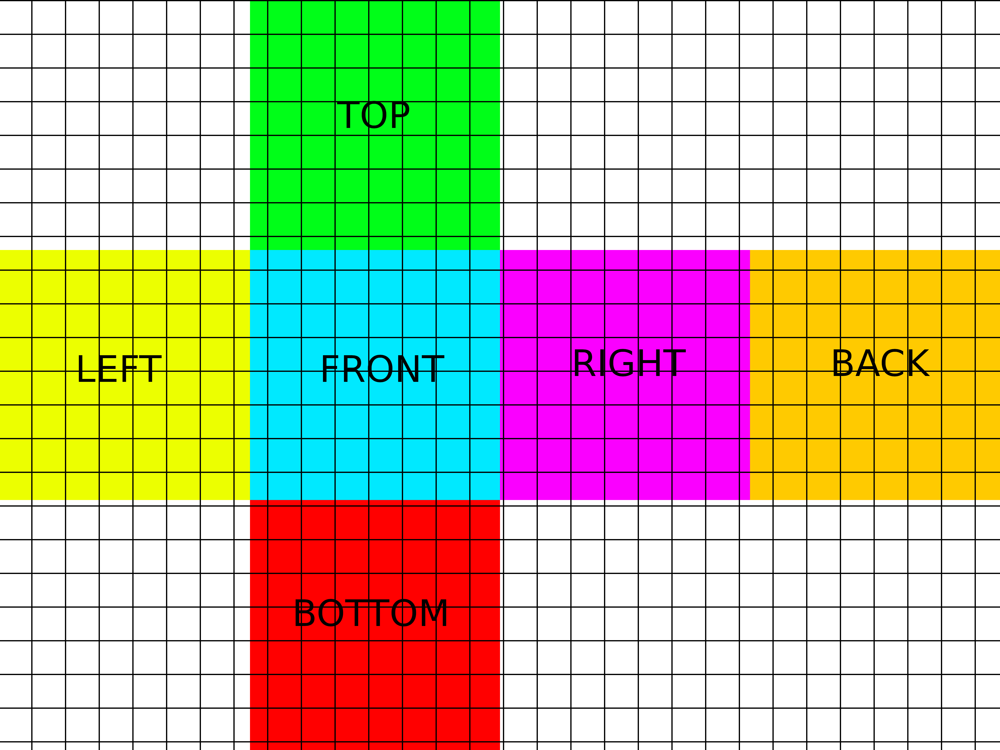
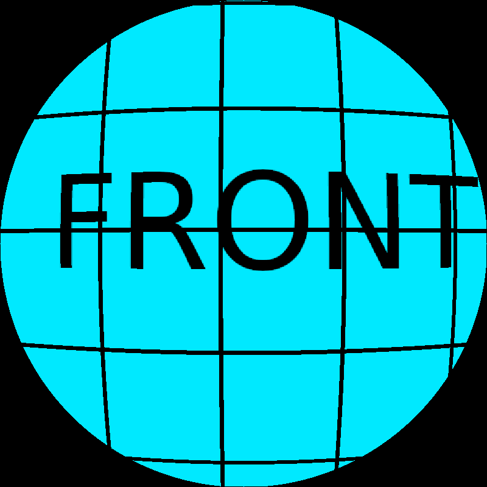
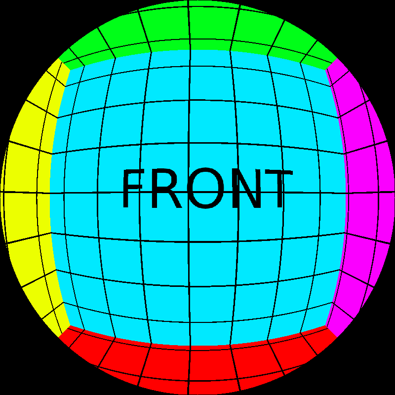
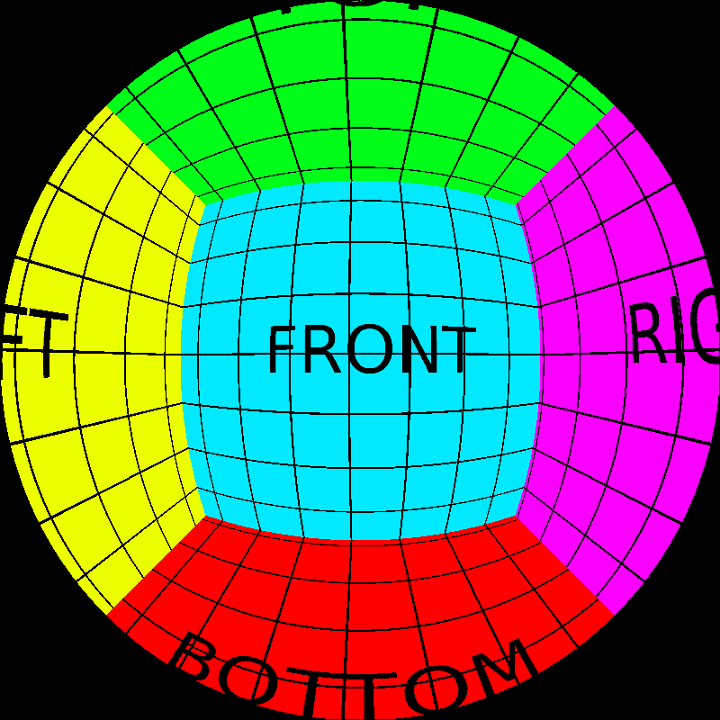
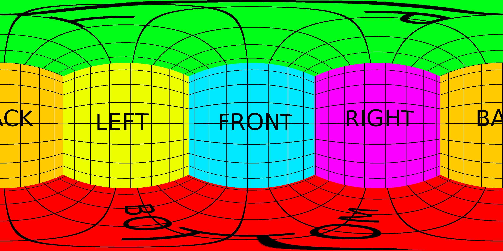

# cubemap-fisheye-equirectangular-convertor

## TODO
- [ ] Implementing of fisheye to cubemap 
- [ ] Implementing of fisheye to equirectangle 

## Usage

With Python 3 and all requirements installed, just run the following command in the folder of the project:
```
python3 cubemap-converter.py
```
## Input files
Input image must be a cubemap with the following structure (see also cubemap.png image):



## Output files

There can be two different outputs:
  - Fisheye image with a certain resolution specified by the user.

|  fisheye fov 60   | fisheye fov 120   | fisheye fov 180|
| --- | --- | --- |
|      |     |  | 

  - Equirectangular image. Its dimensions are fixed and depend on the input image size.

|equirectangle|
|---|
||

# Ref
> https://github.com/michael-good/cubemap-to-projections-converter
